# Restaurant Service Management System - Documentation

---

## Table of Contents

- [1. Overview](#1)
- [2. Architecture](#2)
  - [2.1. Backend Architecture](#2.1)
  - [2.2. Frontend Architecture](#2.2)
  - [2.3. Event-Driven Architecture](#2.3)
  - [2.4. Data layer](#2.4)
- [3. License](#3)
  - [3.1. License Notice](#3.1)

---

<a id="1"></a>

# Overview

<details>
<summary>Relevant source files</summary>

The following files were used as context for generating this wiki page:

- [.gitignore](.gitignore)
- [README.md](README.md)
- [frontend/package-lock.json](frontend/package-lock.json)
- [package-lock.json](package-lock.json)
- [package.json](package.json)
- [serverless.yml](serverless.yml)
- [src/core/infrastructure/repositories/clients/ClaudeAIClient.ts](src/core/infrastructure/repositories/clients/ClaudeAIClient.ts)

</details>


This page introduces the Restaurant Service Management System: its purpose, the two main deployable components (serverless AWS backend and Next.js frontend), the key technologies used, and high-level architecture. For subsystem details, follow the links to the relevant wiki pages throughout.

---

## Purpose

The Restaurant Service Management System automates:

- **Order processing** — accepting dish orders via HTTP or voice commands
- **Kitchen orchestration** — an event-driven pipeline that coordinates ingredient procurement and dish preparation
- **Inventory management** — tracking and atomically deducting warehouse stock, purchasing from an external Farmers Market API when stock is insufficient
- **Voice assistant** — transcribing audio via OpenAI Whisper, extracting intent via Anthropic Claude, and dispatching actions (create order, check status, get inventory, get recommendations)
- **Authentication** — JWT-based access control on all protected endpoints

---

## Main Components

| Component | Directory | Deployment |
|-----------|-----------|------------|
| Backend service (`restaurant-service`) | `src/` | AWS Lambda via Serverless Framework v4 |
| Frontend application | `frontend/` | Vercel (Next.js 14) |

The two components are independently deployable. The frontend communicates exclusively with the backend through API Gateway over HTTP.

---

## Key Technologies

### Backend

| Technology | Role | Version / Detail |
|------------|------|-----------------|
| Node.js | Runtime | 22.19.0 |
| TypeScript | Language | 5.9.3 |
| Serverless Framework | IaC + deploy | v4 (`serverless@4.33.0`) |
| AWS Lambda | Compute | `nodejs22.x`, `arm64` |
| AWS DynamoDB | Persistence | Single-table design (`RestaurantTable`) |
| AWS EventBridge | Async event routing | Custom bus (`RestaurantEventBus`) |
| AWS SQS | Worker queues | `OrderQueue`, `IngredientQueue`, `DishQueue` |
| OpenAI Whisper | Audio-to-text transcription | via `OPENAI_API_KEY` env var |
| Anthropic Claude | LLM intent extraction | `claude-haiku-4-5-20251001` |
| AWS Lambda Powertools | Logging, tracing, parsing | `2.31.0` |
| Zod | Input validation | `4.3.6` |
| `ulid` / `uuid` | ID generation | `3.0.2` / `13.0.0` |

### Frontend

| Technology | Role | Version |
|------------|------|---------|
| Next.js | Framework (App Router) | 14.2.35 |
| TypeScript | Language | ~5 |
| Tailwind CSS | Styling | ~3.4 |
| Axios | HTTP client | ~1.13 |
| SWR | Data fetching | ~2.4 |
| React Hook Form | Form management | ~7.71 |
| Zod | Client-side validation | ~4.3 |
| Lucide React | Icons | ~0.575 |

Sources: [package.json:1-58](), [serverless.yml:1-25](), [frontend/package-lock.json:1-33]()

---

## Repository Structure

```
restaurant-service/
├── src/
│   ├── functions/          # Lambda entry points (one .ts file per handler)
│   ├── core/
│   │   ├── app/            # Use cases, Zod schemas, port interfaces
│   │   ├── config/         # environment.ts — all env var reads
│   │   ├── domain/         # Aggregates, value objects, repository interfaces
│   │   └── infrastructure/ # DynamoDB repos, HTTP/SQS adapters, AI clients
│   └── powertools/         # Shared logger, tracer utilities
├── frontend/               # Next.js application
├── test/                   # Jest unit and integration tests
├── serverless.yml          # AWS resources and Lambda function definitions
├── package.json            # Backend dependencies and npm scripts
└── tsconfig.json           # TypeScript configuration
```

Sources: [README.md:23-41]()

---

## High-Level Architecture

The diagram below maps system responsibilities to their actual AWS resource and `src/functions/` handler names.

**System Component Map**

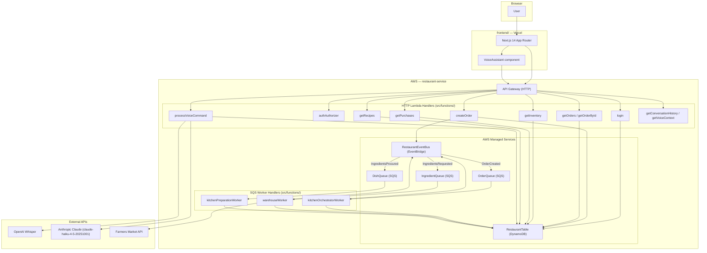

Sources: [serverless.yml:74-241](), [src/core/infrastructure/repositories/clients/ClaudeAIClient.ts:7-19]()

---

## Event-Driven Kitchen Pipeline

Order creation triggers a three-stage asynchronous pipeline. Each stage is a separate Lambda function consuming a dedicated SQS queue, with EventBridge routing between stages using named event types.

**Kitchen Pipeline — Code Entity Flow**

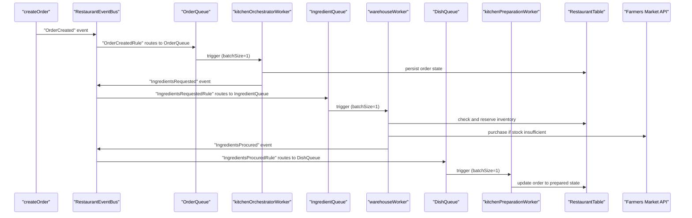

Each queue is backed by a dead-letter queue (`OrderQueueDLQ`, `IngredientQueueDLQ`, `DishQueueDLQ`) with `maxReceiveCount: 3`. For full pipeline details including DLQ behavior, see [Event-Driven Architecture](#2.3).

Sources: [serverless.yml:220-429]()

---

## Lambda Function Summary

The full set of Lambda functions defined in [serverless.yml:74-241]():

| Handler file | HTTP path / Trigger | Auth | Timeout | Memory |
|---|---|---|---|---|
| `login` | `POST /auth/login` | None | 30 s | 512 MB |
| `authAuthorizer` | JWT request authorizer | — | 30 s | 512 MB |
| `createOrder` | `POST /orders` | JWT | 30 s | 512 MB |
| `getOrders` | `GET /orders` | JWT | 30 s | 512 MB |
| `getOrderById` | `GET /orders/{orderId}` | JWT | 30 s | 512 MB |
| `getInventory` | `GET /inventory` | JWT | 30 s | 512 MB |
| `getPurchases` | `GET /purchases` | JWT | 30 s | 512 MB |
| `getRecipes` | `GET /recipes` | JWT | 30 s | 512 MB |
| `processVoiceCommand` | `POST /voice/process` | JWT | **60 s** | **1024 MB** |
| `getConversationHistory` | `GET /voice/conversations/{sessionId}` | JWT | 30 s | 512 MB |
| `getVoiceContext` | `GET /voice/context` | JWT | 30 s | 512 MB |
| `seedData` | Manual invoke | — | 60 s | 1024 MB |
| `kitchenOrchestratorWorker` | `OrderQueue` SQS | — | 30 s | 512 MB |
| `warehouseWorker` | `IngredientQueue` SQS | — | **60 s** | 512 MB |
| `kitchenPreparationWorker` | `DishQueue` SQS | — | 30 s | 512 MB |

Sources: [serverless.yml:74-241]()

---

## Backend Internal Layer Map

The backend follows hexagonal architecture. The table maps each layer to its directory and representative code entities.

| Layer | Directory | Example entities |
|-------|-----------|-----------------|
| Domain | `src/core/domain/` | `Order`, `Recipe`, `Conversation`, `User`, `IWarehouseRepository`, `IVoiceAIClient` |
| Application | `src/core/app/` | Use cases (e.g., `CreateOrderUsecase`, `LoginUsecase`), Zod schemas, port interfaces |
| Infrastructure | `src/core/infrastructure/` | `DynamoRecipeRepository`, `DynamoWarehouseRepository`, `ClaudeAIClient`, HTTP/SQS adapter controllers |
| Entry points | `src/functions/` | One handler file per Lambda (e.g., `createOrder.ts`, `kitchenOrchestratorWorker.ts`) |
| Config | `src/core/config/` | `environment.ts` |
| Observability | `src/powertools/` | `logger`, `tracer` |

For the full backend architecture breakdown, see [Backend Architecture](#2.1). For domain model details, see [Domain Model](#7). For infrastructure and deployment, see [AWS Infrastructure](#6.1) and [CI/CD Pipeline](#6.2).

Sources: [README.md:89-111](), [serverless.yml:1-25]()

---

<a id="2"></a>

# Architecture

<details>
<summary>Relevant source files</summary>

The following files were used as context for generating this wiki page:

- [.github/workflows/deploy.yml](.github/workflows/deploy.yml)
- [.gitignore](.gitignore)
- [frontend/package-lock.json](frontend/package-lock.json)
- [package-lock.json](package-lock.json)
- [serverless.yml](serverless.yml)
- [src/core/app/usecases/ProcessVoiceCommandUsecase.ts](src/core/app/usecases/ProcessVoiceCommandUsecase.ts)
- [src/core/domain/aggregates/Conversation.ts](src/core/domain/aggregates/Conversation.ts)
- [src/core/infrastructure/repositories/DynamoDB/DynamoConversationRepository.ts](src/core/infrastructure/repositories/DynamoDB/DynamoConversationRepository.ts)
- [src/core/infrastructure/repositories/clients/ClaudeAIClient.ts](src/core/infrastructure/repositories/clients/ClaudeAIClient.ts)

</details>


This page describes the overall system architecture of the Restaurant Service Management System: how the frontend, backend Lambda functions, AWS managed services, and external AI services are structured and connected. It also introduces the hexagonal/clean architecture pattern used in the backend.

- For backend internals (layers, controllers, use cases, repositories), see [Backend Architecture](#2.1).
- For frontend structure (App Router layout, auth hooks, API client), see [Frontend Architecture](#2.2).
- For the full asynchronous order pipeline, see [Event-Driven Architecture](#2.3).
- For AWS resource provisioning and IAM, see [AWS Infrastructure](#6.1).

---

## System Components

The system has two independently deployed applications:

| Component | Technology | Runtime / Platform |
|---|---|---|
| `restaurant-service` (backend) | Serverless Framework + AWS Lambda | Node.js 22.x, arm64, AWS `us-east-1` |
| Frontend | Next.js 14 (App Router) | Vercel |

The backend provisions the following AWS resources defined in [serverless.yml:246-460]():

| CloudFormation Resource Name | AWS Type | Role |
|---|---|---|
| `RestaurantTable` | DynamoDB | Single-table store for all entities |
| `RestaurantEventBus` | EventBridge Custom Bus | Async event routing for order pipeline |
| `OrderQueue` + `OrderQueueDLQ` | SQS | Triggers `kitchenOrchestratorWorker`; DLQ retains 14 days |
| `IngredientQueue` + `IngredientQueueDLQ` | SQS | Triggers `warehouseWorker`; DLQ retains 14 days |
| `DishQueue` + `DishQueueDLQ` | SQS | Triggers `kitchenPreparationWorker`; DLQ retains 14 days |

All SQS queues use `maxReceiveCount: 3` before routing to their DLQ. [serverless.yml:337-374]()

External services consumed by the backend:

| Service | Used By | Purpose |
|---|---|---|
| OpenAI Whisper | `processVoiceCommand` | Audio-to-text transcription |
| Anthropic Claude | `processVoiceCommand` | Intent extraction and natural language response |
| Farmers Market API | `warehouseWorker` | Purchasing missing ingredients |

---

## High-Level System Architecture

**Diagram: High-Level System Architecture**

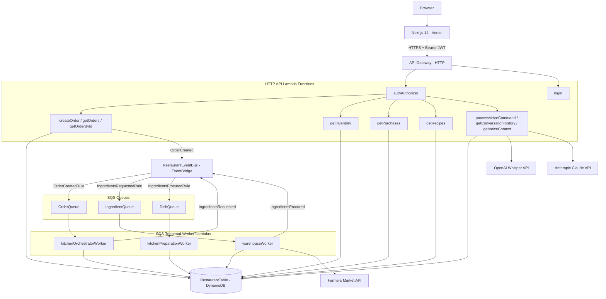

Sources: [serverless.yml:74-241](), [serverless.yml:380-429]()

---

## Backend Hexagonal Architecture

The backend codebase follows a hexagonal (clean) architecture pattern. All domain and application logic lives in `src/core/`, isolated from AWS and external service details. Lambda handlers in `src/functions/` act as thin adapters that invoke use cases.

**Layers:**

| Layer | Path | Contents |
|---|---|---|
| Entry points | `src/functions/` | Lambda handler exports; instantiate and call use cases |
| Application | `src/core/app/usecases/` | Use case classes (e.g., `ProcessVoiceCommandUsecase`) |
| Domain | `src/core/domain/` | Aggregates (`Order`, `Conversation`, `Recipe`, `WarehouseInventory`), port interfaces |
| Infrastructure | `src/core/infrastructure/` | DynamoDB repositories, `ClaudeAIClient`, event publisher |

The domain layer defines interface contracts (ports) that infrastructure implements. Use cases depend only on these interfaces, never on concrete implementations.

**Diagram: Backend Hexagonal Architecture (Code Entities)**

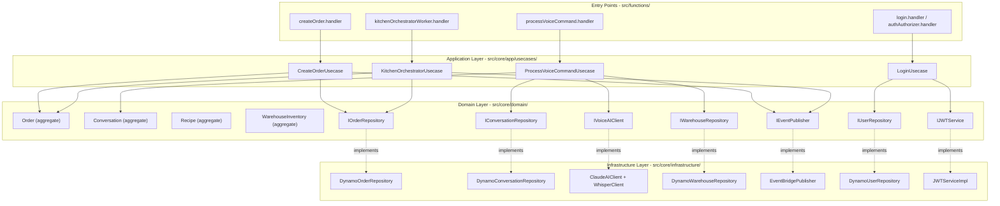

Sources: [src/core/app/usecases/ProcessVoiceCommandUsecase.ts:1-42](), [src/core/infrastructure/repositories/DynamoDB/DynamoConversationRepository.ts:1-20](), [src/core/infrastructure/repositories/clients/ClaudeAIClient.ts:1-20](), [src/core/domain/aggregates/Conversation.ts:1-30]()

---

## Event-Driven Order Pipeline

Order fulfillment is handled asynchronously through a three-stage pipeline driven by `RestaurantEventBus` and three SQS queues. Each stage is an independent Lambda worker.

**Diagram: Three-Stage Order Pipeline**

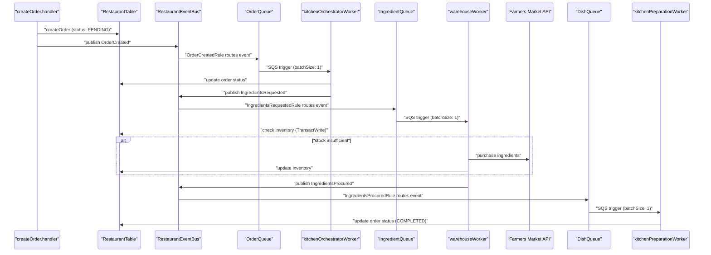

Sources: [serverless.yml:380-429](), [serverless.yml:220-240]()

---

## Voice Command Flow

The `processVoiceCommand` Lambda is the most complex single API endpoint. It orchestrates two external AI calls and five repository calls in sequence.

**Diagram: processVoiceCommand Processing Steps**

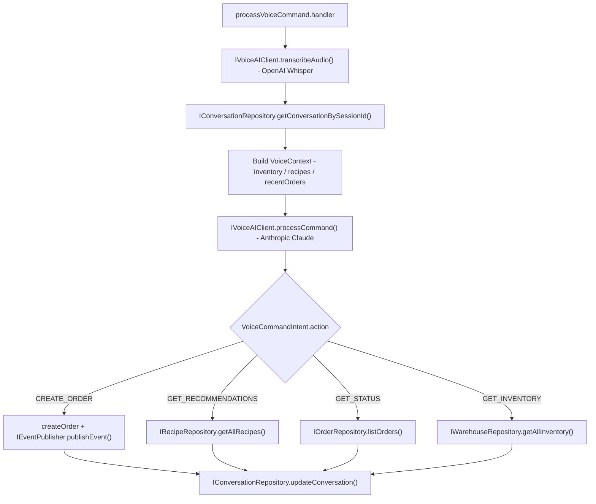

Sources: [src/core/app/usecases/ProcessVoiceCommandUsecase.ts:44-127](), [src/core/domain/aggregates/Conversation.ts:21-24]()

---

## Technology Stack Summary

| Concern | Technology | Version |
|---|---|---|
| Backend runtime | Node.js | 22.x |
| Backend framework | Serverless Framework | 4.x |
| Backend language | TypeScript | 5.9 |
| Backend validation | Zod | 4.x |
| Backend observability | AWS Lambda Powertools (logger, tracer, parser) | 2.31 |
| Backend IDs | `ulid` | 3.x |
| Frontend framework | Next.js (App Router) | 14.2 |
| Frontend HTTP client | Axios | 1.x |
| Frontend forms | react-hook-form | 7.x |
| Frontend data fetching | SWR | 2.x |
| CI/CD | GitHub Actions | — |
| Frontend deployment | Vercel CLI | — |
| Backend deployment | `serverless deploy` | — |

Sources: [package-lock.json:1-48](), [frontend/package-lock.json:1-33](), [.github/workflows/deploy.yml:1-90]()

---

<a id="2.1"></a>

# Backend Architecture

<details>
<summary>Relevant source files</summary>

The following files were used as context for generating this wiki page:

- [package.json](package.json)
- [serverless.yml](serverless.yml)
- [src/core/config/environment.ts](src/core/config/environment.ts)
- [src/core/infrastructure/repositories/clients/ClaudeAIClient.ts](src/core/infrastructure/repositories/clients/ClaudeAIClient.ts)
- [src/functions/login.ts](src/functions/login.ts)
- [src/powertools/utilities.ts](src/powertools/utilities.ts)

</details>


This page describes the internal structure of the serverless backend: how its code is organized into layers, how Lambda entry points are assembled, and how shared utilities are consumed. For the broader view of how the backend relates to the frontend and AWS managed services, see the parent [Architecture](#2) page. For event-driven pipeline details, see [Event-Driven Architecture](#2.3). For endpoint-level documentation, see [API Endpoints Reference](#3.1).

---

## Layered (Hexagonal) Architecture

The backend follows a **hexagonal architecture** (also called ports and adapters / clean architecture). Code is divided into three concentric layers with strict dependency rules: outer layers depend on inner layers, never the reverse.

| Layer | Directory | Responsibility |
|---|---|---|
| Domain | `src/core/domain/` | Aggregates, value objects, domain interfaces (ports), domain errors |
| Application | `src/core/app/usecases/` | Use case orchestration, no framework dependencies |
| Infrastructure | `src/core/infrastructure/` | Adapters (HTTP controllers), repository implementations, external clients |
| Entry Points | `src/functions/` | Lambda handlers — composition root only |

**Composition root pattern.** Each Lambda handler file in `src/functions/` is solely responsible for wiring dependencies together and delegating to a controller. No business logic lives there.

**Layered dependency diagram**

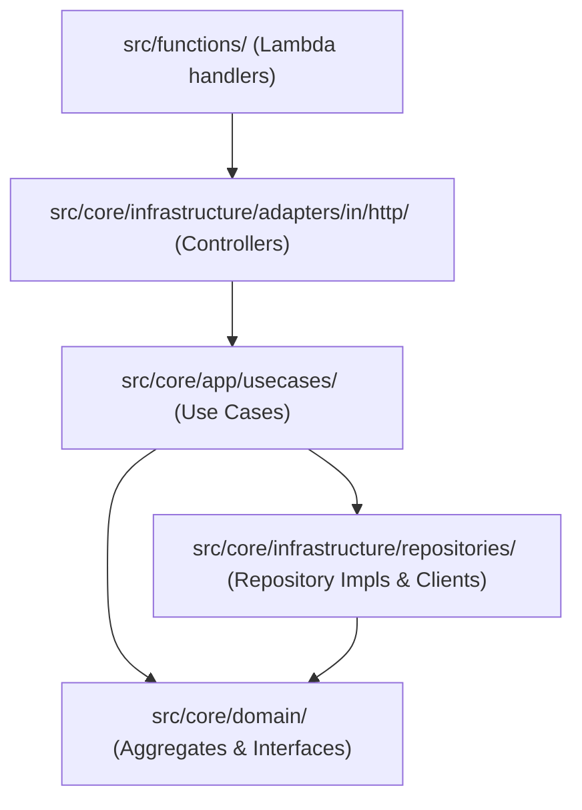

Sources: [src/functions/login.ts](), [src/core/config/environment.ts]()

---

## Lambda Entry Points

Every function defined in `serverless.yml` maps to a single file under `src/functions/`. Each file exports a `handler` function that serves as the AWS Lambda entry point.

**Handler-to-function mapping**

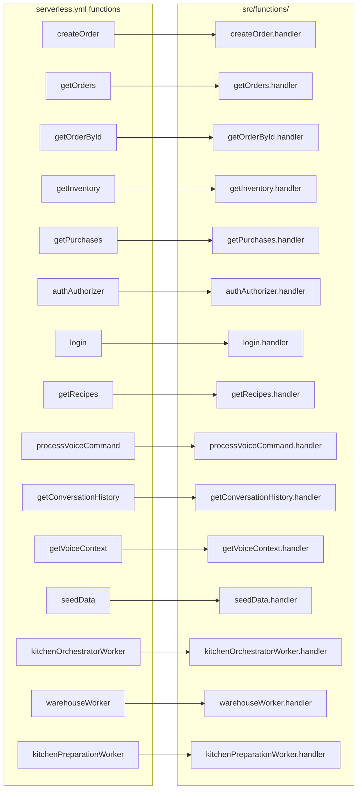

Sources: [serverless.yml:74-241]()

**Default Lambda configuration** (from `provider` block):

| Property | Value |
|---|---|
| Runtime | `nodejs22.x` |
| Architecture | `arm64` |
| Memory | `512 MB` |
| Timeout | `30 s` |
| Stage | `${opt:stage, 'dev'}` |
| Region | `${opt:region, 'us-east-1'}` |

Overrides exist for specific functions: `processVoiceCommand` uses 60 s / 1024 MB, `warehouseWorker` uses 60 s, and `seedData` uses 60 s / 1024 MB.

Sources: [serverless.yml:4-23](), [serverless.yml:169-219]()

---

## Composition Root Pattern

Each handler file instantiates dependencies from the bottom up and passes them to a controller. No dependency injection container is used; construction happens inline.

The `login` handler is a clear reference implementation of this pattern:

**Object graph assembled in `src/functions/login.ts`**

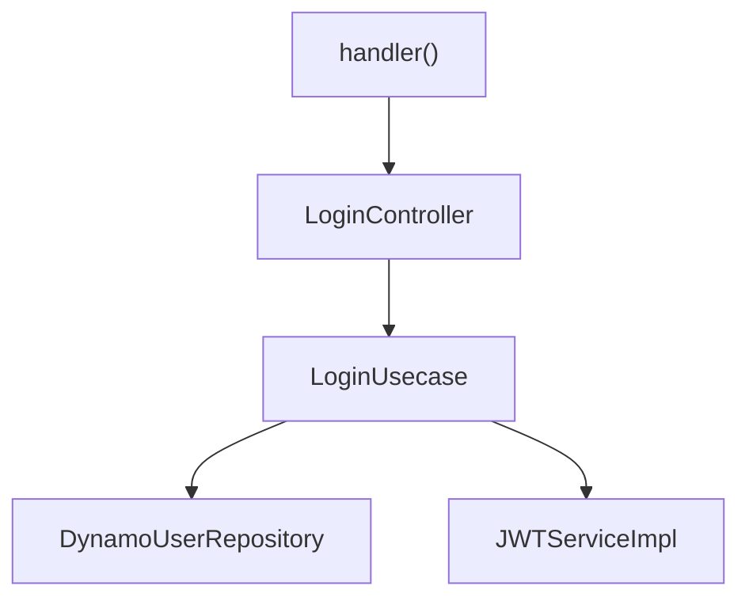

[src/functions/login.ts:9-12]()

```
const userRepository = new DynamoUserRepository()
const jwtService     = new JWTServiceImpl()
const loginUsecase   = new LoginUsecase(userRepository, jwtService)
const controller     = new LoginController(loginUsecase)
```

The same pattern repeats across all HTTP handler files:

1. Instantiate repository implementation(s).
2. Instantiate service implementation(s) (JWT, AI clients, etc.).
3. Instantiate the use case, injecting repositories and services.
4. Instantiate the controller, injecting the use case.
5. The exported `handler` delegates to `controller.execute(event)`.
6. The result is wrapped by `responseHandler` from `@powertools/utilities`.

Sources: [src/functions/login.ts]()

---

## Controller → Use Case → Repository Wiring

**How an HTTP request flows through the layers**

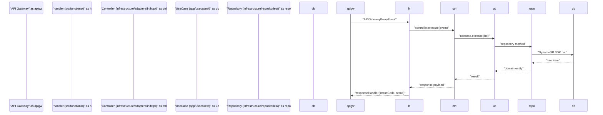

Sources: [src/functions/login.ts]()

**Naming conventions**

| Role | Naming Pattern | Example |
|---|---|---|
| Handler file | `<feature>.ts` | `login.ts` |
| Controller | `<Feature>Controller` | `LoginController` |
| Use case | `<Action>Usecase` | `LoginUsecase` |
| DynamoDB repository | `Dynamo<Entity>Repository` | `DynamoUserRepository` |
| Service implementation | `<Service>Impl` | `JWTServiceImpl` |
| Domain interface (port) | `I<Service>` | `IJWTService`, `IUserRepository` |

---

## Powertools Utilities

Shared cross-cutting utilities are provided by `src/powertools/utilities.ts`. All handler and infrastructure files import from the path alias `@powertools/utilities`.

### Exported symbols

| Export | Type | Purpose |
|---|---|---|
| `logger` | `Logger` | Structured JSON logging via `@aws-lambda-powertools/logger`, service name `restaurant-service`, log level `DEBUG` |
| `tracer` | `Tracer` | AWS X-Ray tracing via `@aws-lambda-powertools/tracer` |
| `responseHandler` | function | Normalizes success and error responses to `APIGatewayProxyResult` shape with CORS headers |
| `GenerateError` | class | Domain-friendly error carrying `statusCode` and `body`; caught by `responseHandler` to produce structured HTTP error responses |

### `responseHandler` behavior

- If `error` is an instance of `GenerateError`, it throws a serialized JSON error (which API Gateway interprets as a Lambda error response).
- If `error` is any other value, it returns a `500` response with the error message stringified.
- On success, it returns `{ statusCode, body: JSON.stringify(body), headers }` with CORS headers set to `*`.

Sources: [src/powertools/utilities.ts]()

---

## Environment Configuration

All environment variables are read once at module load time in `src/core/config/environment.ts` and exported as a single `config` object. Infrastructure classes and clients import `config` from `@config/environment` rather than reading `process.env` directly.

| `config` key | Environment variable | Default value |
|---|---|---|
| `region` | `REGION` | — |
| `sdkSocketTimeout` | `SDK_SOCKET_TIMEOUT` | — |
| `sdkConnectionTimeout` | `SDK_CONNECTION_TIMEOUT` | — |
| `serviceTableName` | `SERVICE_TABLE_NAME` | `restaurant-service-dev` |
| `serviceEventBus` | `SERVICE_EVENT_BUS` | `restaurant-service-dev` |
| `farmersMarketApiUrl` | `FARMERS_MARKET_API_URL` | `https://example.com/api/farmers-market/buy` |
| `openaiApiKey` | `OPENAI_API_KEY` | — |
| `anthropicApiKey` | `ANTHROPIC_API_KEY` | — |
| `whisperModel` | `WHISPER_MODEL` | `whisper-1` |
| `claudeModel` | `CLAUDE_MODEL` | `claude-3-5-sonnet-20241022` |
| `jwtSecret` | `JWT_SECRET` | `default-secret-key-change-in-production` |

The variables `OPENAI_API_KEY`, `ANTHROPIC_API_KEY`, and `JWT_SECRET` are injected at deploy time via `--param` flags and have no safe defaults. See [Environment Configuration](#9.1) for the full reference.

Sources: [src/core/config/environment.ts](), [serverless.yml:13-23]()

---

## Infrastructure Sub-directories

The `src/core/infrastructure/` directory is structured into sub-directories by adapter type:

```
src/core/infrastructure/
├── adapters/
│   └── in/
│       └── http/               # Inbound HTTP controllers
├── repositories/
│   ├── DynamoDB/               # DynamoDB repository implementations
│   ├── clients/                # External API clients (ClaudeAIClient, OpenAI/Whisper)
│   └── services/               # Service implementations (JWTServiceImpl)
```

- **`adapters/in/http/`** — Controllers translate API Gateway events into use-case DTOs and back.
- **`repositories/DynamoDB/`** — Implementations of domain repository interfaces (`IUserRepository`, `IWarehouseRepository`, etc.) backed by DynamoDB via the AWS SDK v3.
- **`repositories/clients/`** — Wrappers for external HTTP APIs. `ClaudeAIClient` calls the Anthropic Messages API; an equivalent client calls OpenAI's Whisper transcription endpoint.
- **`repositories/services/`** — Implementations of domain service interfaces (`IJWTService` → `JWTServiceImpl`).

For detail on repository implementations, see [Repository Implementations](#4.2). For domain interface definitions, see [Domain Model](#7).

Sources: [src/core/infrastructure/repositories/clients/ClaudeAIClient.ts](), [src/functions/login.ts]()

---

<a id="2.2"></a>

# Frontend Architecture

<details>
<summary>Relevant source files</summary>

The following files were used as context for generating this wiki page:

- [frontend/app/layout.tsx](frontend/app/layout.tsx)
- [frontend/components/LayoutClient.tsx](frontend/components/LayoutClient.tsx)
- [frontend/lib/api.ts](frontend/lib/api.ts)
- [frontend/lib/hooks/useAuth.ts](frontend/lib/hooks/useAuth.ts)
- [frontend/lib/types.ts](frontend/lib/types.ts)

</details>


This page describes the structural organization of the Next.js frontend application: the App Router layout hierarchy, the `LayoutClient` wrapper that handles conditional rendering, the global authentication state via `useAuth`, the Axios-based API client, and the shared TypeScript type definitions. It also covers where the `VoiceAssistant` is mounted in the component tree.

For detailed documentation on individual subsystems, see:
- Authentication form, `localStorage` session storage, and the `useAuth` hook: [Frontend Authentication](#5.2)
- Voice assistant components, state machine, and audio capture: [Voice Assistant UI](#5.3)
- All exported API functions and the `types.ts` module in depth: [API Client](#5.4)
- Application pages and navigation routes: [Application Structure](#5.1)

---

## High-Level Component Tree

**Component hierarchy from root layout to page content**

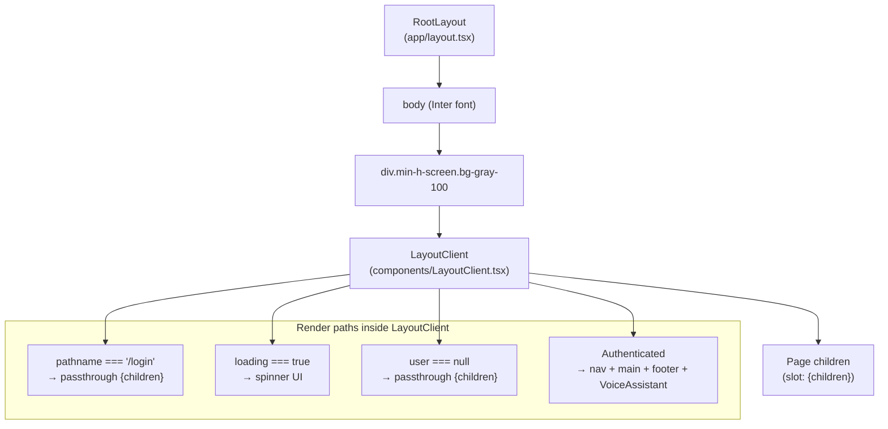

Sources: [frontend/app/layout.tsx:1-27](), [frontend/components/LayoutClient.tsx:1-95]()

---

## App Router Entry Point

The root layout is defined in [frontend/app/layout.tsx:13-27](). It is a React Server Component that:

- Sets the `Inter` font via `next/font/google`
- Exports `metadata` with the page title and description
- Wraps all page content in `<LayoutClient>`, which runs client-side

```
RootLayout
  └── <html lang="en">
        └── <body className={inter.className}>
              └── <div className="min-h-screen bg-gray-100">
                    └── <LayoutClient>
                          └── {children}  ← page-specific content
```

Because `RootLayout` is a Server Component, interactive logic (auth checks, routing) lives in `LayoutClient`, which is marked `'use client'`.

Sources: [frontend/app/layout.tsx:1-27]()

---

## LayoutClient

`LayoutClient` ([frontend/components/LayoutClient.tsx:9-83]()) is the central dispatch component for the application shell. It consumes the `useAuth` hook and selects one of three render paths based on authentication state.

**Render path decision table**

| Condition | Render output |
|---|---|
| `pathname === '/login'` | `<>{children}</>` — no nav, no auth check |
| `loading === true` | Full-screen spinner |
| `user === null` | `<>{children}</>` — allows redirect to complete |
| `user` is set | Full layout: nav + `<main>` + footer + `<VoiceAssistant />` |

Key responsibilities:

- Reads `user`, `loading`, and `logout` from `useAuth`
- Renders the top navigation bar with links to: `/` (Create Order), `/orders`, `/inventory`, `/purchases`, `/recipes`
- Displays the authenticated user's `email` in the nav
- Mounts `<VoiceAssistant />` globally for all authenticated pages ([frontend/components/LayoutClient.tsx:81]())
- Renders page content inside a constrained `<main>` block

Sources: [frontend/components/LayoutClient.tsx:1-95]()

---

## Authentication State: `useAuth`

`useAuth` ([frontend/lib/hooks/useAuth.ts:12-65]()) is the sole source of authentication state in the frontend. It is consumed by `LayoutClient` and any page component that needs to know the current user.

**`useAuth` data flow**

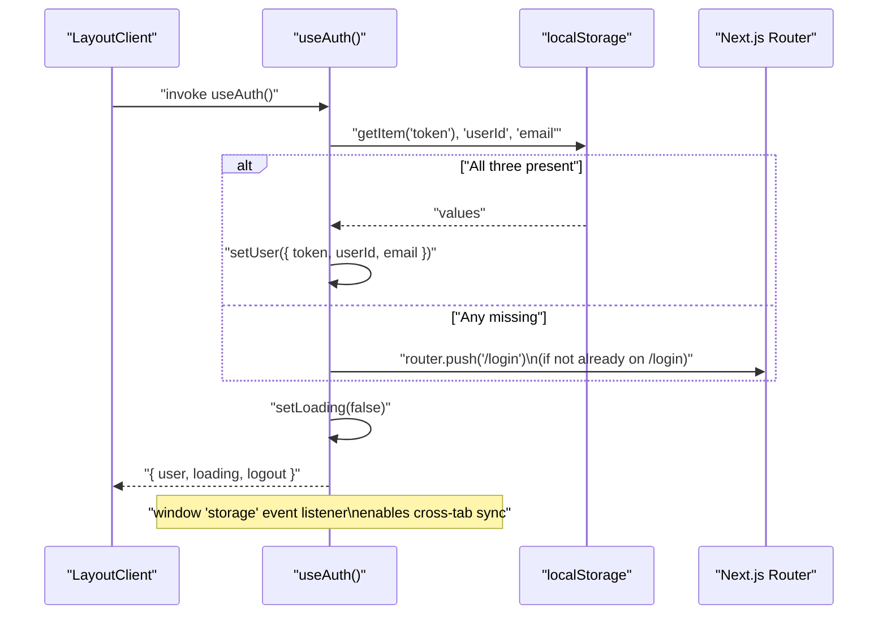

**Exported interface**

| Export | Type | Description |
|---|---|---|
| `user` | `AuthUser \| null` | Current authenticated user or `null` |
| `loading` | `boolean` | `true` until the initial `localStorage` check completes |
| `logout` | `() => void` | Clears `localStorage`, resets `user`, redirects to `/login` |

The `AuthUser` interface ([frontend/lib/hooks/useAuth.ts:6-10]()) contains `userId`, `email`, and `token`.

Cross-tab synchronization is implemented by listening to the `window` `storage` event ([frontend/lib/hooks/useAuth.ts:37-54]()), so logging out in one tab updates all others.

Sources: [frontend/lib/hooks/useAuth.ts:1-65]()

---

## API Client

The API client module at `frontend/lib/api.ts` exports a configured Axios instance and typed wrapper functions for all backend endpoints.

**API client structure**

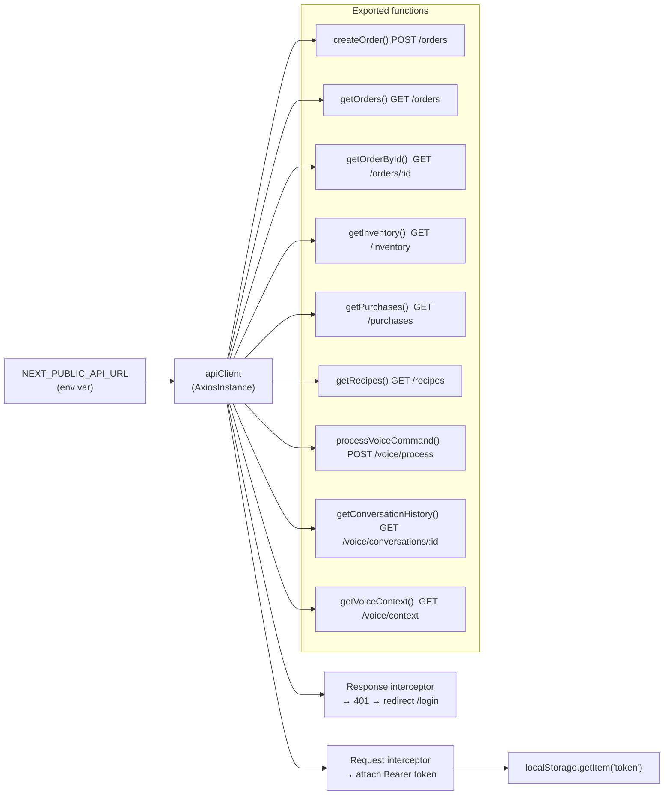

**Axios instance configuration** ([frontend/lib/api.ts:19-25]()):

| Property | Value |
|---|---|
| `baseURL` | `NEXT_PUBLIC_API_URL` or `http://localhost:3000` |
| `timeout` | `10000` ms |
| `Content-Type` | `application/json` |

The request interceptor ([frontend/lib/api.ts:28-37]()) reads `token` from `localStorage` (guarded by `typeof window !== 'undefined'` for SSR safety) and sets `Authorization: Bearer <token>`.

The response interceptor ([frontend/lib/api.ts:40-55]()) catches `401` responses, clears `localStorage`, and redirects to `/login` via `window.location.href`.

Sources: [frontend/lib/api.ts:1-141]()

---

## Shared Type Definitions

All TypeScript types shared between pages, components, hooks, and the API client are defined in `frontend/lib/types.ts`. The table below summarizes the key types grouped by domain.

**Type definitions overview**

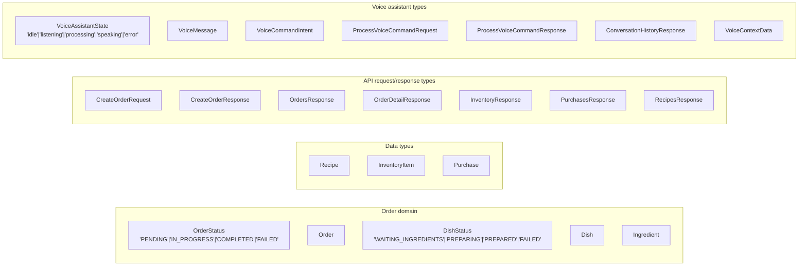

**Selected type shapes**

| Type | Key fields |
|---|---|
| `Order` | `orderId`, `quantity`, `status: OrderStatus`, `createdAt`, `completedAt?` |
| `Dish` | `dishId`, `orderId`, `recipeId`, `recipeName`, `status: DishStatus`, `ingredients` |
| `Recipe` | `recipeId`, `name`, `ingredients: Ingredient[]` |
| `InventoryItem` | `ingredientName`, `availableQuantity`, `updatedAt` |
| `Purchase` | `purchaseId`, `ingredientName`, `quantityPurchased`, `purchasedAt`, `orderId?` |
| `VoiceMessage` | `messageId`, `role: 'user'\|'assistant'`, `content`, `timestamp` |
| `VoiceCommandIntent` | `action: 'CREATE_ORDER'\|'GET_RECOMMENDATIONS'\|'GET_STATUS'\|'GET_INVENTORY'\|'UNKNOWN'`, `parameters?` |
| `ProcessVoiceCommandRequest` | `sessionId`, `audio` (base64), `audioFormat` |

Sources: [frontend/lib/types.ts:1-141]()

---

## Voice Assistant Integration Point

The `VoiceAssistant` component is mounted once, globally, inside `LayoutClient` ([frontend/components/LayoutClient.tsx:81]()). It is only rendered when a user is authenticated (the fourth render path). This means the voice assistant persists across page navigations without being unmounted, preserving conversation session state.

For full documentation of the `VoiceAssistant` component internals, see [Voice Assistant UI](#5.3).

Sources: [frontend/components/LayoutClient.tsx:79-82]()

---

## Module Dependency Map

**How frontend modules relate to each other**

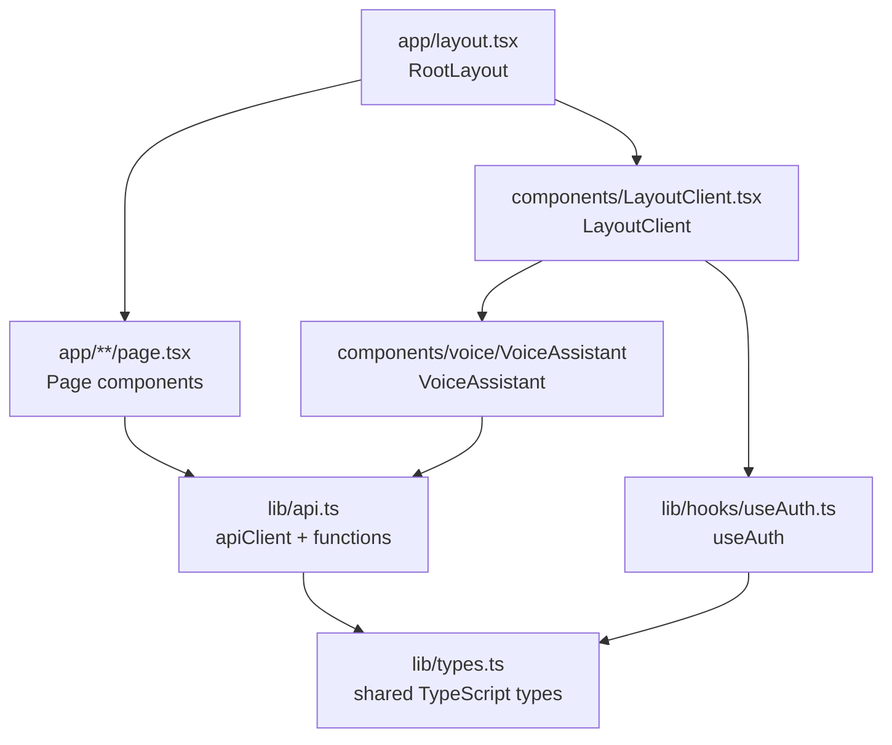

Sources: [frontend/app/layout.tsx:1-27](), [frontend/components/LayoutClient.tsx:1-8](), [frontend/lib/api.ts:1-14](), [frontend/lib/hooks/useAuth.ts:1-10]()

---

<a id="2.3"></a>

# Event-Driven Architecture

<details>
<summary>Relevant source files</summary>

The following files were used as context for generating this wiki page:

- [serverless.yml](serverless.yml)
- [src/core/app/usecases/GetVoiceContextUsecase.ts](src/core/app/usecases/GetVoiceContextUsecase.ts)
- [src/core/app/usecases/ProcureIngredientsUsecase.ts](src/core/app/usecases/ProcureIngredientsUsecase.ts)
- [src/core/infrastructure/repositories/clients/ClaudeAIClient.ts](src/core/infrastructure/repositories/clients/ClaudeAIClient.ts)

</details>


This page documents the asynchronous, event-driven pipeline that handles order fulfillment in the restaurant-service backend. It covers the EventBridge event bus, the three SQS queues and their dead-letter queues, the three worker Lambda functions, and the end-to-end flow from order creation to dish preparation.

For a broader overview of the backend's hexagonal layers, controllers, and use cases, see [Backend Architecture](#2.1). For HTTP endpoint details for the order creation trigger, see [API Endpoints Reference](#3.1). For the inventory reservation and procurement logic, see [Inventory & Procurement](#3.5).

---

## Overview

When a client submits an order, the system does not process it inline. Instead, a chain of events propagates through **EventBridge → SQS → Lambda workers**, decoupling each processing stage. This allows each stage to fail and retry independently without blocking the HTTP response to the caller.

The pipeline has three distinct stages:

| Stage | Event That Starts It | Worker Lambda | Event Published Next |
|---|---|---|---|
| **Orchestration** | `OrderCreated` | `kitchenOrchestratorWorker` | `IngredientsRequested` |
| **Procurement** | `IngredientsRequested` | `warehouseWorker` | `IngredientsProcured` |
| **Preparation** | `IngredientsProcured` | `kitchenPreparationWorker` | *(terminal stage)* |

All events share a single custom event bus: `RestaurantEventBus`. EventBridge routing rules match on `source` and `detail-type` to deliver each event type to the correct SQS queue.

Sources: [serverless.yml:320-430]()

---

## Infrastructure Components

### Event Bus

A dedicated custom EventBridge bus named `restaurant-service-{stage}` isolates restaurant events from the default AWS event bus.

```
RestaurantEventBus:
  Type: AWS::Events::EventBus
  Name: restaurant-service-${stage}
```

All events published by the system use `source: "restaurant.service"`.

Sources: [serverless.yml:322-326]()

### SQS Queues and Dead-Letter Queues

Three main queues and three DLQs are provisioned. All share identical retry configuration:

| Queue | DLQ | `VisibilityTimeout` | `maxReceiveCount` | DLQ Retention |
|---|---|---|---|---|
| `OrderQueue` | `OrderQueueDLQ` | 120 s | 3 | 14 days |
| `IngredientQueue` | `IngredientQueueDLQ` | 120 s | 3 | 14 days |
| `DishQueue` | `DishQueueDLQ` | 120 s | 3 | 14 days |

`maxReceiveCount: 3` means a message that fails processing three times is moved to its DLQ automatically by SQS. The 14-day (`1209600` seconds) retention on DLQs gives operators a window to investigate and replay failed messages.

Sources: [serverless.yml:331-374]()

### EventBridge Routing Rules

Three rules each match a specific `detail-type` and forward messages to the corresponding SQS queue. Each rule also specifies a DLQ as a `DeadLetterConfig` for delivery failures at the EventBridge-to-SQS level.

| Rule | `source` Filter | `detail-type` Filter | Target Queue |
|---|---|---|---|
| `OrderCreatedRule` | `restaurant.service` | `OrderCreated` | `OrderQueue` |
| `IngredientsRequestedRule` | `restaurant.service` | `IngredientsRequested` | `IngredientQueue` |
| `IngredientsProcuredRule` | `restaurant.service` | `IngredientsProcured` | `DishQueue` |

EventBridge uses a dedicated IAM role (`EventBridgeRole`) with `sqs:SendMessage` permissions on all six queues (three main + three DLQs).

Sources: [serverless.yml:380-459]()

---

## End-to-End Pipeline Diagram

**Three-Stage Kitchen Pipeline**

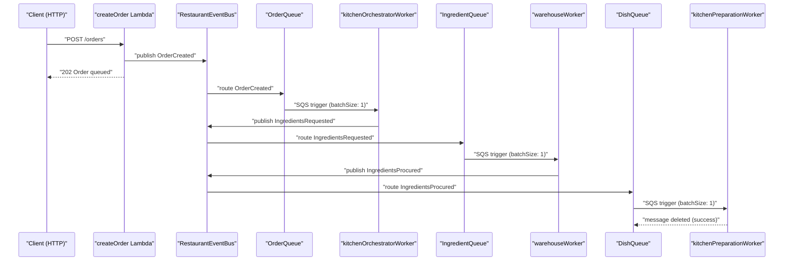

Sources: [serverless.yml:220-240](), [serverless.yml:380-430]()

---

## Stage 1 — Orchestration

**Handler:** `src/functions/kitchenOrchestratorWorker.handler`  
**Trigger:** `OrderQueue` SQS event, `batchSize: 1`

The orchestrator receives the `OrderCreated` event and is responsible for decomposing the order into per-dish ingredient requirements. For each dish in the order, it emits an `IngredientsRequested` event containing the recipe ID, dish ID, and the list of required ingredients with quantities.

Each event carries a payload such as:
- `orderId`
- `dishId`
- `recipeId` / `recipeName`
- `ingredients[]` — the list from the recipe

Processing `batchSize: 1` ensures that each SQS message is processed atomically, so a failure for one order does not block others.

Sources: [serverless.yml:220-226]()

---

## Stage 2 — Procurement

**Handler:** `src/functions/warehouseWorker.handler`  
**Trigger:** `IngredientQueue` SQS event, `batchSize: 1`  
**Timeout:** 60 seconds  
**Key Use Case:** `ProcureIngredientsUsecase`

This stage is the most complex. The `warehouseWorker` invokes `ProcureIngredientsUsecase`, which:

1. Checks each ingredient's current inventory using `IWarehouseRepository.getInventory()`.
2. Computes available quantity as `availableQuantity - reservedQuantity`.
3. If insufficient stock exists, purchases the deficit from the Farmers Market API via `IFarmersMarketClient.buyIngredient()`.
4. Calls `IWarehouseRepository.addStock()` for each successful purchase and records the transaction via `IPurchaseRepository.recordPurchase()`.
5. Once all ingredients are satisfied, calls `IWarehouseRepository.reserveIngredients()` to lock them for the dish.
6. Publishes an `IngredientsProcured` event.

**Farmers Market retry behavior:** The use case retries up to 5 times with exponential backoff (`2^attempt * 1000` ms). This is distinct from the SQS-level retry (which operates at the message level after the Lambda throws).

Sources: [src/core/app/usecases/ProcureIngredientsUsecase.ts:1-146](), [serverless.yml:227-233]()

**Procurement Flow Detail**

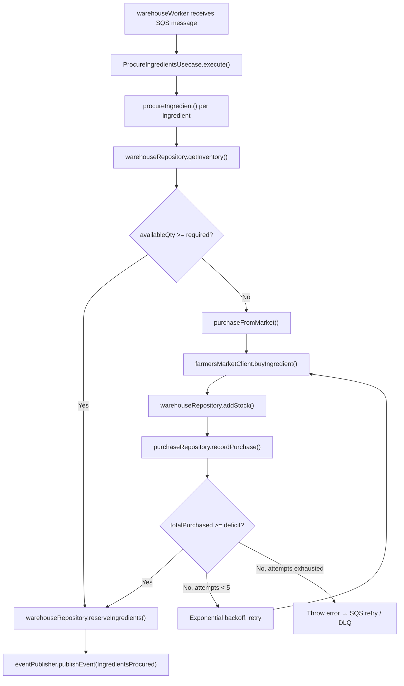

Sources: [src/core/app/usecases/ProcureIngredientsUsecase.ts:27-141]()

---

## Stage 3 — Preparation

**Handler:** `src/functions/kitchenPreparationWorker.handler`  
**Trigger:** `DishQueue` SQS event, `batchSize: 1`

The preparation worker receives the `IngredientsProcured` event and performs the final step: deducting the reserved ingredients from inventory and transitioning the order/dish status to its completed state. Because ingredients are already reserved by the procurement stage, this step is largely a status update and deduction operation.

Sources: [serverless.yml:235-240]()

---

## Retry and Error Handling

**Component-Level Failure Map**

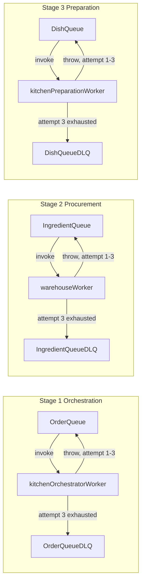

### Retry layers

There are two independent retry layers for Stage 2 (procurement), which is the most failure-prone:

1. **Application-level retries** (`ProcureIngredientsUsecase.purchaseFromMarket`): up to 5 attempts with exponential backoff within a single Lambda invocation, to handle transient Farmers Market API failures.
2. **SQS-level retries**: if the Lambda function throws (e.g., all 5 internal retries exhausted), SQS will re-deliver the message up to `maxReceiveCount: 3` times before routing it to `IngredientQueueDLQ`.

The `VisibilityTimeout` of 120 seconds on all queues gives each Lambda invocation enough time to complete before another consumer can see the same message. The `warehouseWorker` has an explicit `timeout: 60` seconds, well within this window.

Sources: [serverless.yml:331-374](), [src/core/app/usecases/ProcureIngredientsUsecase.ts:88-134]()

---

## IAM Permissions

The `EventBridgeRole` is a distinct IAM role assumed by `events.amazonaws.com` (not by Lambda). It exists solely to allow EventBridge to deliver messages to the SQS queues.

Lambda functions use the provider-level IAM role, which grants `sqs:*` on the three main queues and `events:PutEvents` on `RestaurantEventBus`.

| Principal | Permission | Resources |
|---|---|---|
| `events.amazonaws.com` via `EventBridgeRole` | `sqs:SendMessage` | `OrderQueue`, `IngredientQueue`, `DishQueue`, `*DLQ` |
| Lambda execution role | `events:PutEvents` | `RestaurantEventBus` |
| Lambda execution role | `sqs:*` | `OrderQueue`, `IngredientQueue`, `DishQueue` |

Sources: [serverless.yml:25-51](), [serverless.yml:435-459]()

---

## Code Entity Map

**Event-Driven Code Entities**

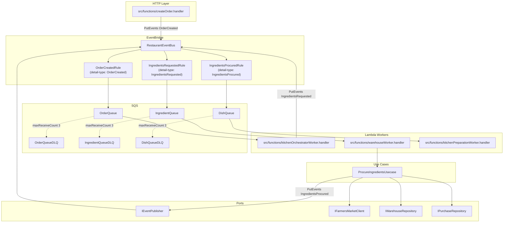

Sources: [serverless.yml:220-240](), [serverless.yml:380-430](), [src/core/app/usecases/ProcureIngredientsUsecase.ts:1-58]()

---

---

<a id="2.4"></a>

# Data Layer

<details>
<summary>Relevant source files</summary>

The following files were used as context for generating this wiki page:

- [serverless.yml](serverless.yml)
- [src/core/infrastructure/repositories/DynamoDB/DynamoWarehouseRepository.ts](src/core/infrastructure/repositories/DynamoDB/DynamoWarehouseRepository.ts)
- [src/core/infrastructure/repositories/clients/ClaudeAIClient.ts](src/core/infrastructure/repositories/clients/ClaudeAIClient.ts)

</details>


This page describes how the Restaurant Service Management System persists and accesses data. It covers the storage backend, the key design decisions, and the repository abstraction pattern used throughout the backend.

- For how these repositories are consumed by domain use cases, see [Backend Architecture](#2.1).

---

## Storage Backend

All persistent state is stored in a single DynamoDB table named `restaurant-service-{stage}`. The table is defined in [serverless.yml:253-317]() and uses **on-demand (PAY_PER_REQUEST)** billing, meaning no capacity planning is required.

| Property | Value |
|---|---|
| Table name | `restaurant-service-{stage}` |
| Billing mode | `PAY_PER_REQUEST` |
| Primary key | `PK` (HASH) + `SK` (RANGE) |
| Global Secondary Indexes | GSI1, GSI2, GSI3 |
| TTL attribute | `TTL` |
| DynamoDB Streams | `NEW_AND_OLD_IMAGES` |

Sources: [serverless.yml:253-317]()

---

## Single-Table Design

All entity types — users, inventory, conversations, login attempts, orders, and recipes — share one table. Entities are distinguished by their `PK` prefix (e.g., `USER#`, `INVENTORY#`, `ORDER#`). The `SK` value provides secondary organization within each entity's partition (e.g., `METADATA`, or a sub-entity identifier).

Three Global Secondary Indexes (GSI1, GSI2, GSI3) allow cross-entity query patterns without table scans. Each GSI has its own `GSIPxPK` and `GSIPxSK` pair stored as item attributes. All GSIs use `ProjectionType: ALL`, so no additional reads are needed after index lookups.

**Single-table entity map:**

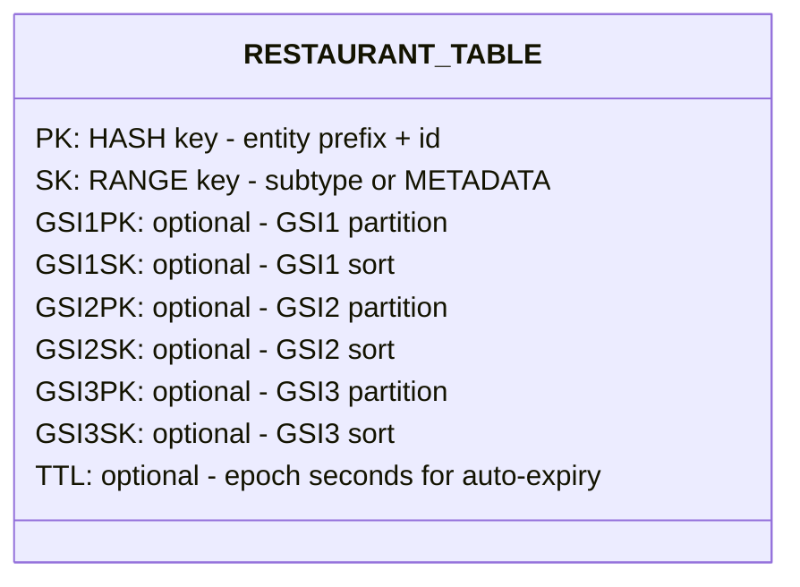

Sources: [serverless.yml:259-309]()

---

## Entity Key Patterns

Each entity type uses a predictable key prefix convention. The following table summarizes the known patterns derived from the repository implementations:

| Entity | PK Pattern | SK Value | GSI Used | GSI PK Value |
|---|---|---|---|---|
| User | `USER#{userId}` | `METADATA` | — | — |
| Inventory item | `INVENTORY#{ingredientName}` | `METADATA` | GSI2 | `TYPE#INVENTORY` |
| Order | `ORDER#{orderId}` | `METADATA` | — | — |
| Recipe | `RECIPE#{recipeId}` | `METADATA` | — | — |
| Conversation | `CONVERSATION#{sessionId}` | `METADATA` or message ID | — | — |
| Login attempt | `LOGIN_ATTEMPT#{userId}` | timestamp or attempt ID | — | — |
| Purchase record | `PURCHASE#{purchaseId}` | `METADATA` | — | — |

The `INVENTORY#` key pattern is explicitly visible in `DynamoWarehouseRepository` at [src/core/infrastructure/repositories/DynamoDB/DynamoWarehouseRepository.ts:36-45](), where the warehouse `TransactWrite` targets keys of the form `INVENTORY#{name}` with `SK = METADATA`.

The `getAllInventory()` query at [src/core/infrastructure/repositories/DynamoDB/DynamoWarehouseRepository.ts:87-99]() uses `GSI2` with `GSI2PK = 'TYPE#INVENTORY'` to retrieve all inventory records without a full table scan.

Sources: [src/core/infrastructure/repositories/DynamoDB/DynamoWarehouseRepository.ts:36-99](), [serverless.yml:283-309]()

---

<a id="3"></a>

## 📄 License

The project is distributed under the **Apache 2.0** licence.

---
<a id="3.1"></a>

## Licence notice

The implementation is intentionally limited in scope and simplicity.

Any use beyond evaluation requires the explicit written permission of the author.

**Author:** Kenny Julián Luque Ticona

---
